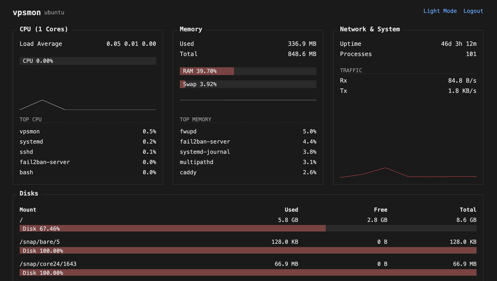

<p align="center">
  
</p>

# vpsmon

Lightweight system monitor for Linux VPS. Single Go binary, ~5MB RAM usage.

<p align="center">
  
</p>

Monitors CPU, memory, swap, disk, network, uptime, and process count. Web UI with login, auto-refreshes every 5 seconds.

## Installation

```bash
curl -sL https://raw.githubusercontent.com/leodeim/vpsmon/main/install.sh | sudo bash
```

## Useful Commands

Once installed on your VPS, you can manage the monitor using these commands:

- **Check status:** `sudo systemctl status vpsmon`
- **View live logs:** `sudo journalctl -u vpsmon -f`
- **Update to latest:** `sudo bash /opt/vpsmon/update.sh`
- **Restart service:** `sudo systemctl restart vpsmon`
- **Edit configuration:** `sudo nano /opt/vpsmon/.env` (Restart required after changing port or credentials)
- **Uninstall:** `sudo bash /opt/vpsmon/uninstall.sh`

## Environment Variables

| Variable | Default | Description |
|---|---|---|
| `MONITOR_ADDR` | `:8088` | Listen address |
| `MONITOR_USER` | `admin` | Web UI username |
| `MONITOR_PASS_HASH` | (hash of `changeme`) | Web UI password (bcrypt hash) |
