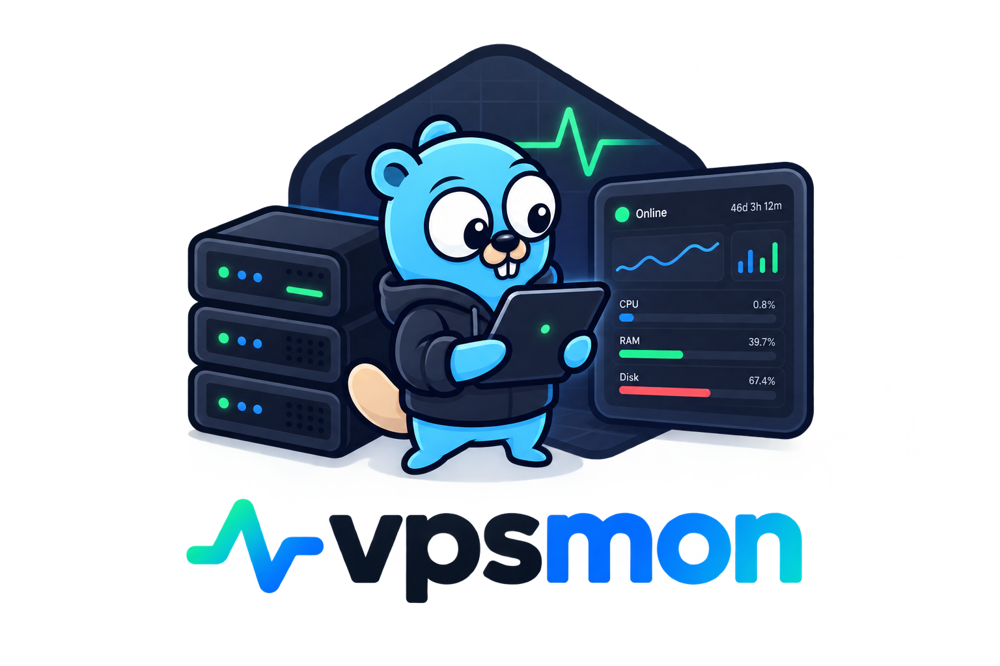
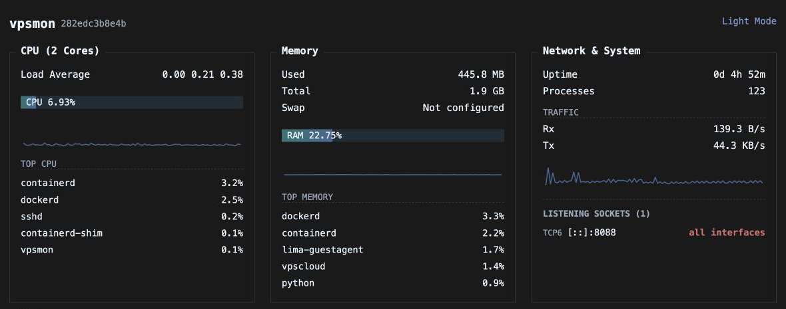
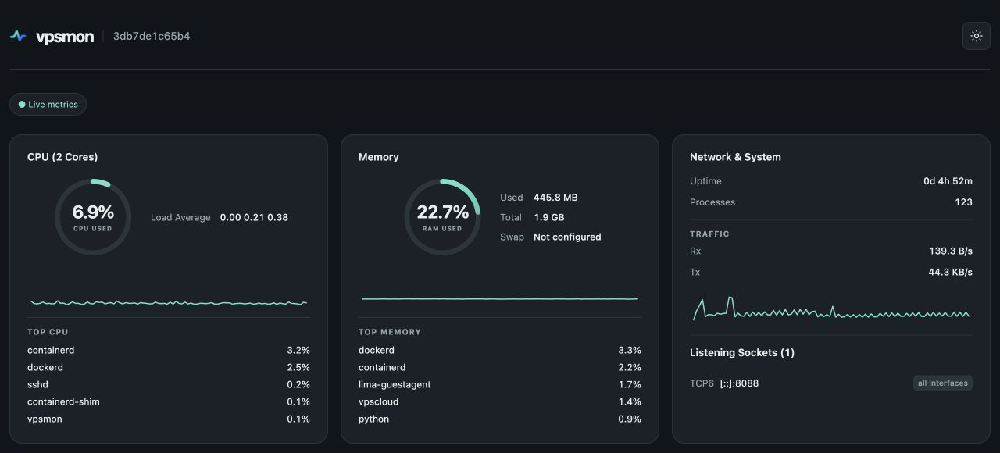

<p align="center">
  
</p>

<p align="center">
  <a href="https://github.com/leodeim/vpsmon/actions/workflows/build.yml"></a>
  <a href="https://github.com/leodeim/vpsmon/releases/latest"></a>
  <a href="https://github.com/leodeim/vpsmon/releases"></a>
  <a href="https://github.com/leodeim/vpsmon/blob/main/LICENSE"></a>
</p>

## Features

- **Live System Metrics:** CPU, Memory, Swap, and Load Average
- **Docker Integration:** Shows container image, status, health, uptime, restart count, ports, CPU/RAM, and recent logs
- **Process Monitoring:** Shows the top 5 processes by CPU and Memory usage
- **Disk & Network:** Tracks used/free space across all mounts and live network Rx/Tx speeds
- **Listening Sockets:** Audits TCP listeners and bound UDP sockets, highlighting services bound to all interfaces
- **Optional GPU Monitoring:** Shows NVIDIA (`nvidia-smi`) or AMD ROCm (`amd-smi`) GPU utilization, VRAM, and temperature when available
- **Built-in Security:** Password-protected Web UI (bcrypt) with login rate-limiting, optionally disabled for trusted networks or authenticating proxies
- **Ultra Lightweight:** Single Go binary with zero dependencies and ~5MB RAM footprint

`vpsmon` is a local dashboard. It contains no Cloud uploader and never sends metrics to VPSmon Cloud. The separate [vpsagent](https://github.com/leodeim/vpsagent) provides opt-in Cloud monitoring. Both programs use the open-source [vpsmonlib](https://github.com/leodeim/vpsmonlib) collector.

Source builds use the published `vpsmonlib` Go module.

## Installation

```bash
curl -sL https://raw.githubusercontent.com/leodeim/vpsmon/main/scripts/install.sh | sudo bash
```

## Themes

### Terminal
<p align="center">
  
</p>

### Modern
<p align="center">
  
</p>

## Useful Commands

Once installed on your VPS, you can manage the monitor using these commands:

- **Check status:** `sudo systemctl status vpsmon`
- **View live logs:** `sudo journalctl -u vpsmon -f`
- **Update to latest:** `sudo bash /opt/vpsmon/update.sh`
- **Restart service:** `sudo systemctl restart vpsmon`
- **Edit configuration:** `sudo nano /opt/vpsmon/.env` (Restart required after changing port or credentials)
- **Uninstall:** `sudo bash /opt/vpsmon/uninstall.sh`

## Environment Variables

| Variable | Default | Description |
|---|---|---|
| `MONITOR_ADDR` | `:8088` | Listen address |
| `MONITOR_USER` | `admin` | Web UI username |
| `MONITOR_PASS_HASH` | (hash of `changeme`) | Web UI password (bcrypt hash) |
| `MONITOR_SKIN` | `terminal` | Dashboard skin: `terminal` or `modern`; chosen during installation |
| `MONITOR_NO_AUTH` | `false` | Set to `true`, `yes`, `on`, or `1` to disable the login screen and session checks |
| `MONITOR_TRUSTED_PROXIES` | `loopback` | Comma-separated proxy IPs/CIDRs allowed to supply client IP via `X-Forwarded-For`/`X-Real-IP` for login rate limiting. `loopback` = `127.0.0.0/8,::1/128`; empty = trust none. Avoid `*` (trust all), which allows IP spoofing. |

Existing direct installations and local Caddy setups using `reverse_proxy 127.0.0.1:8088` need no configuration change. If a reverse proxy connects from another IP or container, add its source IP or CIDR (for example, `MONITOR_TRUSTED_PROXIES=loopback,10.0.0.4`). Include `loopback` if you also use a local proxy. Without the setting, visitors behind that proxy share one login rate limit: five submissions within five minutes. For a systemd installation, edit `/opt/vpsmon/.env` and restart the service. For Docker Compose, set the variable in the Compose `.env` file and recreate the container.

## Reverse Proxy (HTTPS)

[Caddy](https://caddyserver.com/) is the easiest way to expose `vpsmon` with automatic HTTPS. Add the following to your `Caddyfile`:

```caddyfile
monitor.yourdomain.com {
    reverse_proxy 127.0.0.1:8088
}
```
